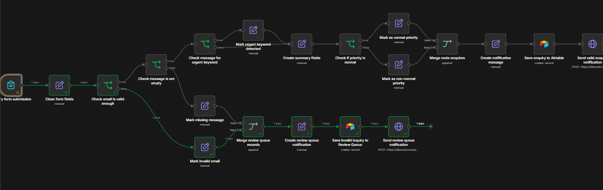
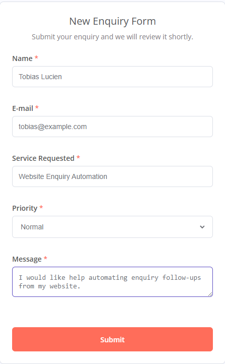
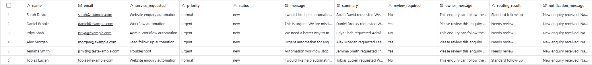
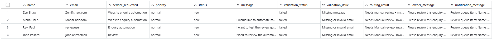
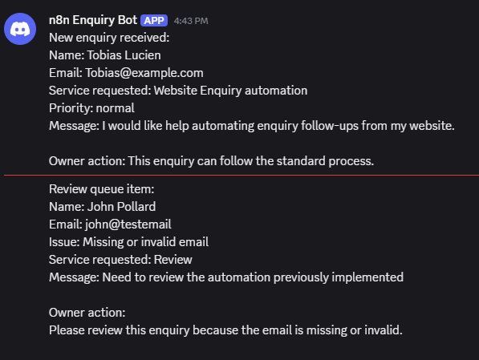

# n8n Enquiry Routing Automation

**Workflow Automation System for Lead Capture, Validation, Review Routing and Notifications**

---

## :rocket: Project Overview

This project is a **workflow automation demo** that demonstrates how n8n can be used to automate small-business enquiry handling by:

- Capturing enquiry submissions through a form
- Validating required fields and basic email format
- Routing valid enquiries into an Airtable tracker
- Sending incomplete or problem records to a Review Queue
- Sending Discord webhook notifications when action is required

It demonstrates a practical **end-to-end automation workflow**, combining form input, data cleaning, validation logic, conditional routing, external database storage, and notification handling.

Built using **n8n**, **Airtable**, **Discord Webhooks**, and **Docker**, the workflow is designed as a local portfolio demo showing production-style thinking around maintainability, human review, and safe handling of test data.

---

## :brain: Key Features

- :memo: Form-Based Enquiry Capture  
Captures enquiry details including name, email, service requested, priority and message.

- :broom: Field Cleaning and Normalisation  
Maps user-facing form labels into clean internal workflow fields for easier downstream processing.

- :white_check_mark: Validation Logic  
Checks for valid-enough email format and required message content before processing.

- :rotating_light: Urgent Keyword Detection  
Detects urgent wording in enquiry messages and routes those records for priority review.

- :twisted_rightwards_arrows: Conditional Routing  
Routes normal enquiries, urgent enquiries and incomplete/problem records through different workflow paths.

- :file_cabinet: Airtable Tracking  
Stores valid enquiries in an Airtable Enquiries table and problem records in a separate Review Queue.

- :bell: Discord Notifications  
Sends Discord webhook notifications when new enquiries or review queue items are created.

- :shield: Human Review Safety Layer  
Ensures incomplete or suspicious submissions are not silently processed as normal records.

---

## :hammer_and_wrench: Tech Stack

- n8n
- Docker
- Airtable
- Discord Webhooks
- n8n Form Trigger
- HTTP Request node
- Conditional IF logic
- Expressions and field mapping

---

## :zap: How It Works

### 1. Form Submission

- User submits an enquiry through an n8n form
- Form captures name, email, service requested, priority and message
- Required fields are enforced at form level where possible

### 2. Field Cleaning

- Form labels are normalised into clean internal field names
- Priority values are standardised for consistent routing logic

### 3. Validation and Review Routing

- Email is checked for basic validity
- Message field is checked for missing content
- Invalid or incomplete records are routed to a Review Queue

### 4. Urgent Enquiry Detection

- The workflow checks whether the enquiry message contains urgent wording
- Urgent keyword detection can override a normal priority selection
- Urgent records are routed for manual review

### 5. Airtable and Notification Output

- Valid enquiries are saved to the Airtable Enquiries table
- Problem records are saved to the Airtable Review Queue
- Discord webhook notifications are sent to alert the owner

---

## :bar_chart: Workflow Output

- **Valid Enquiries Table:** Stores clean enquiries ready for follow-up
- **Review Queue Table:** Stores invalid, incomplete or review-needed submissions
- **Discord Notifications:** Alerts the owner when a new enquiry or review item is created
- The Review Queue intentionally includes incomplete or poorly formatted synthetic submissions to demonstrate how the workflow handles messy real-world input instead of silently failing.

> :warning: **Note:**  
> This project uses fake test data and runs as a local portfolio demo. It is designed to demonstrate workflow logic and automation design rather than operate as a deployed production system.

---

## :file_folder: Project Structure

```bash
n8n-enquiry-routing-demo/
│
├── README.md
├── workflows/
│   └── demo-1-enquiry-routing-review-queue-sanitised.json
└── screenshots/
    ├── workflow-canvas.png
    ├── form-submission.png
    ├── airtable-enquiries.png
    ├── airtable-review-queue.png
    └── discord-notification.png
```

---

## :dart: Why This Project Matters

- Demonstrates a practical **small-business automation use case**
- Shows ability to connect multiple tools into one workflow
- Covers common automation requirements:
  - Form capture
  - Data validation
  - Conditional routing
  - External database storage
  - Notifications
  - Human review
- Designed with maintainability, clear node naming and safe test-data handling in mind
- Provides a foundation for future freelance automation services

---

## :warning: Limitations

- Runs as a **local n8n demo**, not a hosted production system
- Uses **synthetic data only**
- Not connected to a real client website or CRM
- Email validation is basic and not full email verification
- Discord is used as a Slack-style notification substitute
- Error handling is limited and can be improved with dedicated error workflows
- Production use would require hosting, credential management, monitoring and data protection review
- Review Queue examples use synthetic messy data to demonstrate validation and manual review handling.

---

## :framed_picture: Demo

<p align="center">
  <br/>
  <strong>n8n workflow canvas showing form capture, validation, routing, Airtable storage and Discord notifications</strong>
</p>

<p align="center">
  <br/>
  <strong>Enquiry form used to capture test submissions</strong>
</p>

<p align="center">
  <br/>
  <strong>Airtable Enquiries table storing valid routed submissions</strong>
</p>

<p align="center">
  <br/>
  <strong>Airtable Review Queue storing invalid or review-needed records</strong>
</p>

<p align="center">
  <br/>
  <strong>Discord webhook notification for new enquiry alerts</strong>
</p>

---

## :computer: How to Run Locally

1. Run n8n locally using Docker.

2. Import the workflow JSON into n8n:

```bash
workflows/demo-1-enquiry-routing-review-queue-sanitised.json
```

3. Create the required Airtable base and tables:

```text
Enquiries
Review Queue
```

4. Add your own Airtable Personal Access Token and Discord Webhook URL inside n8n credentials/node settings.

5. Use the n8n test form URL to submit synthetic enquiry data.

> :warning: **Important:**  
> Do not commit Airtable tokens, Discord webhook URLs or other credentials to GitHub.

> :lock: **Public Workflow Export:**  
> The public workflow JSON has been sanitised. Credentials, webhook URLs, Airtable identifiers, form URLs and instance metadata have been replaced with placeholders.

---

## :bulb: Key Learning

- Building form-triggered automation workflows in n8n
- Cleaning and normalising form data before processing
- Using IF nodes for validation and conditional routing
- Creating separate paths for valid and invalid records
- Saving workflow output to Airtable
- Sending real Discord webhook notifications
- Understanding why storage should happen before external notifications
- Designing human-review safety layers for incomplete or suspicious records

---

## :crystal_ball: Future Improvements

- Deploy n8n to a hosted environment
- Add a production-ready public form
- Add dedicated n8n error workflows
- Log failed executions to an Error Log table
- Add duplicate enquiry detection
- Add unique enquiry IDs and timestamps
- Add stronger email validation
- Add Slack, Teams or email notifications
- Connect to a real CRM or business inbox
- Create a short demo video or GIF

---

## :warning: Disclaimer

This workflow is for educational and portfolio demonstration purposes only. It uses fake test data and should not be used with real client, patient, financial or sensitive data without proper hosting, security, monitoring, access control and data protection review.

---